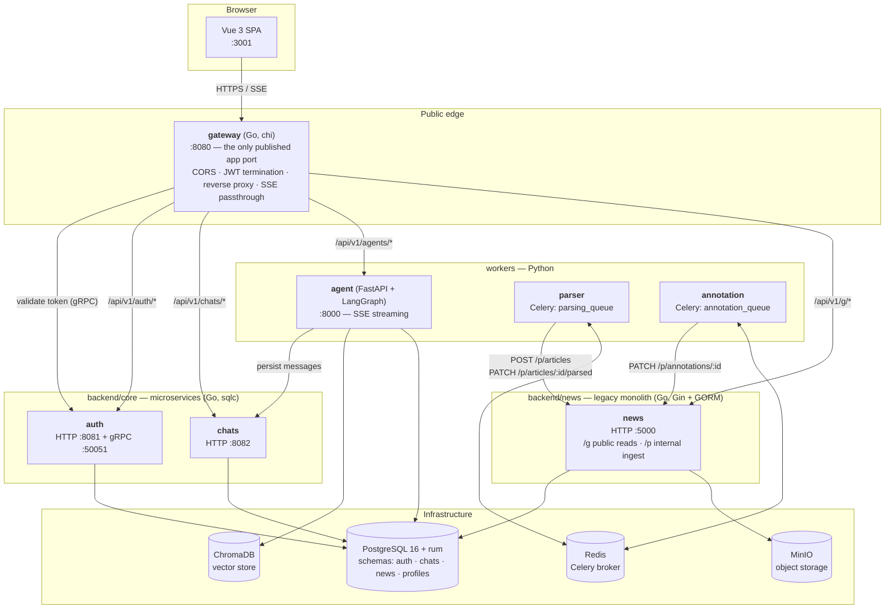
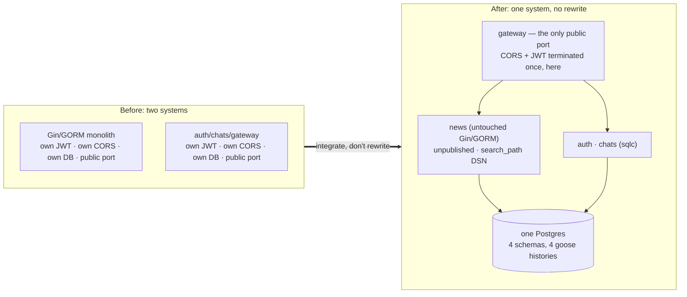
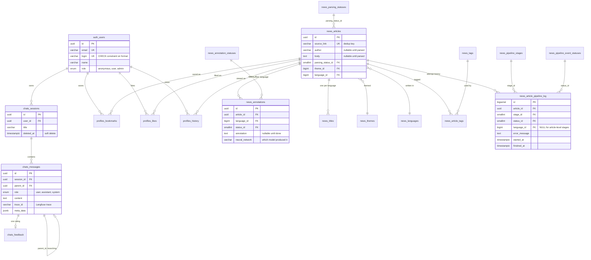
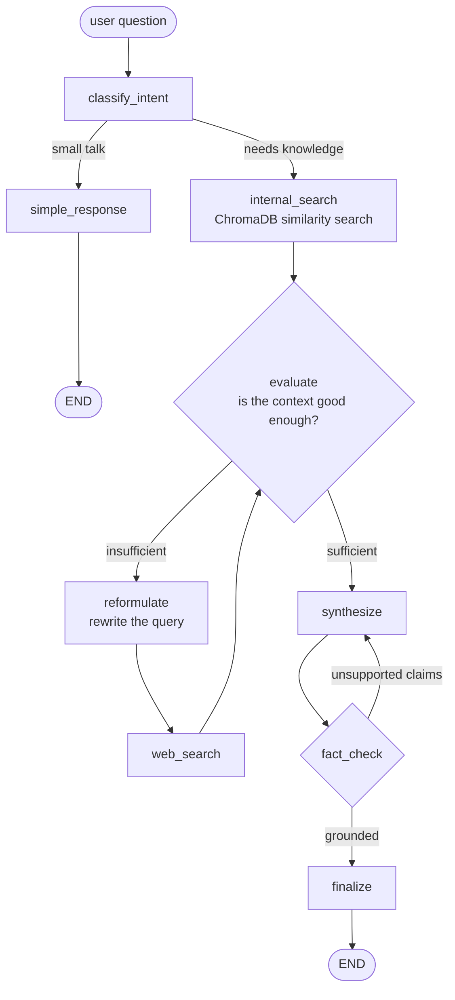
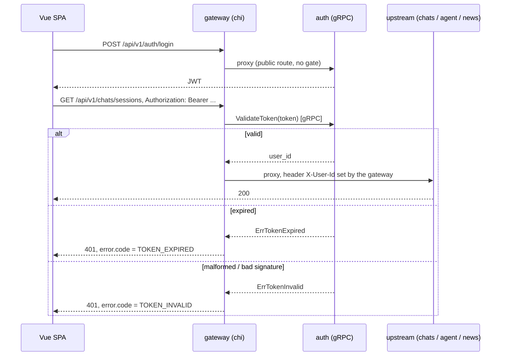

# AI News Platform

A self-hosted news platform that **scrapes**, **annotates with a local LLM**, and **serves** cybersecurity/tech news — plus a **RAG chat agent** that answers questions over that same corpus.

The interesting part is not any single service. It is that this system is the **integration of two independently-developed codebases**: a legacy Gin/GORM monolith that already owned the news domain, and a newer set of Go microservices (auth / chats / gateway) built around gRPC, `sqlc` and goose migrations. The monolith was **deliberately not rewritten** — it was wrapped, put behind a gateway, and given a new machine-facing ingest API. This README explains how, and why that turned out to be the cheaper decision.

**Stack:** Go (Gin, chi, gRPC, GORM, sqlc) · Python (FastAPI, LangGraph, Celery, BeautifulSoup) · Vue 3 + TypeScript + Vite + Tailwind · PostgreSQL 16 (+ RUM) · Redis · ChromaDB · MinIO · Docker Compose

---

## Table of contents

- [Architecture at a glance](#architecture-at-a-glance)
- [The legacy integration](#the-legacy-integration-the-part-im-actually-proud-of)
- [The ingest pipeline: scraping and annotation](#the-ingest-pipeline-scraping-and-annotation)
- [Database design](#database-design)
- [The RAG agent](#the-rag-agent)
- [Auth and the gateway](#auth-and-the-gateway)
- [Running it](#running-it)
- [Repository layout](#repository-layout)
- [Status and roadmap](#status-and-roadmap)

---

## Architecture at a glance

Everything reachable from a browser goes through **one** public port: the gateway on `:8080`. Every other service is unpublished and only addressable from inside the Docker network — which is a security boundary the design leans on heavily (see [ingest](#the-ingest-pipeline-scraping-and-annotation)).



Three different runtimes (Go, Python, Node), five application services, one database. The glue is deliberately boring: HTTP + JSON between services that change often, gRPC where the contract is stable and hot (token validation), Celery/Redis where work is long-running and must survive a crash.

---

## The legacy integration (the part I'm actually proud of)

`backend/news` is the older codebase: Gin, GORM, hand-rolled JWT middleware, its own `go.mod`, its own idea of how a database connection works. `backend/core` is the newer one: chi, gRPC, `sqlc`-generated queries, goose migrations, a clean `transport → service → storage → domain` layering.

The obvious move is to port the news domain into the microservice layout. I didn't, for the usual honest reasons: the monolith **worked**, it owned the schema, and a rewrite would have paid for itself in bugs long before it paid for itself in elegance. Instead it was **integrated as a peer service** — kept intact, given a boundary, and made to look like just another upstream from the outside.

Four decisions made that possible:

**1. One database, one schema per bounded context.** Rather than either a shared soup of tables or five separate Postgres instances, there is one physical database with four schemas — `auth`, `chats` (owned by the microservices) and `news`, `profiles` (owned by the monolith). Cross-context foreign keys are allowed exactly where the domain genuinely demands them: `chats.sessions.user_id → auth.users.id`, `profiles.bookmarks → auth.users` **and** `→ news.articles`. That last one is the whole point — a bookmark is a fact that spans both codebases, and modelling it as a real FK is honest about that instead of pretending two systems that share a user don't.

**2. The monolith never learned about schemas.** GORM models have no schema tags and no per-query qualification. Instead the DSN sets `search_path=news,profiles,public` — so every legacy query resolves into the right schemas untouched:

```go
// backend/news/src/models/db.go
dsn := fmt.Sprintf(
    "host=%s ... dbname=%s sslmode=disable application_name=news-backend "+
    "search_path=news,profiles,public", ...)
```

One line of DSN replaced what would otherwise have been an edit to every model and every query in the service.

**3. Migrations were unified even though the code wasn't.** A one-shot `migrate` container runs goose over both repositories' SQL, in dependency order, before any application service starts. Each schema gets its **own** version table in `public` — `goose_db_version_auth`, `..._chats`, `..._news`, `..._profiles` — so the two codebases keep independent migration histories while landing in one database:

```sh
apply auth     /sql/core/auth/migrations
apply chats    /sql/core/chats/migrations   # chats.sessions → auth.users
apply news     /sql/news/news/migrations
apply profiles /sql/news/profiles/migrations # → auth.users AND news.articles
```

Application containers wait on `condition: service_completed_successfully`, so "did the migrations run?" is never a question anyone has to ask.

**4. CORS, JWT and the public surface moved out of the monolith entirely.** `backend/news` publishes no port. It has no CORS config. Its public reads (`/api/v1/g/*`) are proxied by the gateway; its ingest routes (`/api/v1/p/*`) are reachable only from sibling containers. Auth is terminated once, at the edge, by a service built for it — the monolith's own JWT middleware still exists for its original routes, but nothing on the public path depends on it.



What the monolith *did* get was a new **machine-facing API** — but that was additive (`/p/articles/*`, `/p/annotations/*`), written in its own existing idiom, and it replaced a synchronous scraping flow with an asynchronous one. No existing endpoint changed shape.

---

## The ingest pipeline: scraping and annotation

News gets in via two Celery workers behind Redis. They run under a Compose profile (`--profile jobs`) so they don't start with the rest of the stack.

### The flow

```mermaid
sequenceDiagram
    autonumber
    participant P as producer.py
    participant N as news (Gin/GORM)
    participant R as Redis
    participant SC as parsing.scrape_source
    participant AN as annotation.annotate_article
    participant LLM as Local LLM (Ollama/LM Studio)

    P->>P: crawl CyberNews category listings
    P->>N: POST /p/articles {source_link, language_code}
    alt 201 Created — genuinely new
        N-->>P: draft id (parsing_status = PENDING_PARSING)
        P->>R: enqueue parsing.scrape_source(id, url) → parsing_queue
    else 409 Conflict — already known
        N-->>P: existing id
        Note over P: skip; a whole page of 409s stops pagination
    end

    R->>SC: deliver task
    SC->>N: PATCH /p/articles/:id/parsed {parsing_status: PARSING}
    SC->>N: POST /p/articles/:id/events {stage: PARSING, status: STARTED}
    SC->>SC: cloudscraper fetch → JSON-LD → CSS fallback
    SC->>N: PATCH .../parsed {PARSED, title, author, body}
    SC->>N: POST /p/articles/:id/annotations → annotation job (PENDING)
    SC->>R: send_task annotation.annotate_article → annotation_queue

    R->>AN: deliver task
    AN->>N: GET /p/articles/:id
    AN->>LLM: annotate(title, body)
    LLM-->>AN: summary
    AN->>N: PATCH /p/annotations/:id {ANNOTATED, annotation, neural_network}
    AN->>N: POST /p/articles/:id/events {stage: ANNOTATION, status: SUCCEEDED}
```

### Details worth calling out

**Draft-first ingest.** The producer reserves a row (`source_link` + language only) *before* anything is fetched. `source_link` is `UNIQUE`, so deduplication is enforced by the database, not by application logic racing itself — and the API answers **409 with the existing id**, not 200 with a flag, because the producer's entire decision hinges on that answer and a status code is much harder to accidentally ignore than a boolean in a body. It also let the crawler drop its "max duplicates" heuristic: a listing page where nothing is new stops pagination, which means the first run against a source goes deep and every run afterwards costs one or two pages.

**Two-tier parsing that survives redesigns.** Title and author come from **schema.org JSON-LD** first (`Article`/`NewsArticle`/`BlogPosting`, including the `@graph` + `@id` reference form most SEO plugins emit), falling back to CSS heuristics only when that yields nothing. This is not premature abstraction — the site's own `article-info__link` / `heading` classes already drifted out from under a redesign while its JSON-LD block didn't. Body text is scoped to the nearest `<article>`/`.content` container rather than a page-wide `<p>` sweep, because the page-wide version cheerfully ingested nav menus and copyright footers.

**Cloudflare.** The target 403s a plain `requests.get()`, so both producer and worker use `cloudscraper` with a randomised browser/platform fingerprint, and each worker process keeps **one** scraper instance — solving the challenge has real per-instance cost and there's no reason to pay it per task.

**Crash-safe queues.** The Celery config is where the operational thinking lives:

| Setting | Why |
| --- | --- |
| `task_acks_late=True` | A task leaves the queue when it *finishes*, not when it's picked up — a killed worker's in-flight task is redelivered instead of vanishing. |
| `worker_prefetch_multiplier=1` | Without it, late-ack still lets a crash lose or duplicate a whole prefetched batch instead of one task. |
| `task_reject_on_worker_lost=True` | A dead prefork child (segfault, OOM kill) is noticed by its parent and requeued immediately. |
| `visibility_timeout=300` | The backstop for a whole container disappearing. Redis's default is **1 hour** — far too long for recovery, so it's cut to 5 minutes, still well above any realistic task duration (LLM calls included). |

Redelivery is safe because every write path is an idempotent, upsert-shaped `PATCH` against a known id — a duplicate delivery wastes compute, it doesn't corrupt state.

**Swappable annotation models.** The LLM backends sit behind a `GenerationModel` interface with concrete implementations for Gemma 2B / 4B-E4B / 7B, Mistral and OpenChat, so changing which model annotates the corpus is a one-line change in the task — and `annotations.neural_network` records which model actually produced each row, so a corpus annotated by several models over time stays attributable.

**Task routing by name, not module.** Queues are routed on the `parsing.*` / `annotation.*` task-name prefix, so the two workers can live in separate containers with separate images and no shared imports. `parsing.scrape_source` hands off with `app.send_task("annotation.annotate_article", ...)` — enqueue by name, resolved by whichever worker owns that queue.

**The ingest API is unauthenticated on purpose.** `/p/articles/*` has no JWT middleware. That is a deliberate, documented trade: `news` publishes no port, so those routes are reachable only from sibling containers on the Compose network. The alternative — workers holding admin credentials and refreshing JWTs to talk to a service that isn't on the internet — is more moving parts protecting a boundary the network already provides.

---

## Database design

One PostgreSQL 16 instance, four schemas, two owners.



### Things in here I'd defend in an interview

**Status vocabularies are lookup tables, not enums — but only where they churn.** `articles.parsing_status_id`, `annotations.status_id` and `article_pipeline_log.status_id` all reference small `(id, code, sequence_order, description)` tables. Adding a status is an `INSERT`. Meanwhile `auth.user_role`, `chats.message_role` and `chats.feedback_rating` are left as native Postgres `ENUM`s. The split is on **churn rate**, not on dogma: the pipeline's vocabulary had already needed one full type-recreation migration to narrow itself, while a message's role has been `user | assistant | system` since the day the protocol was written and will stay that way.

**One status column became two, before it had to.** `articles.status` originally described the whole pipeline as a single scalar. That breaks the instant annotation goes multi-language — "done in English, pending in French" does not fit in one column. So `articles.parsing_status_id` was narrowed to describe *parsing only*, and `news.annotations` was promoted from a text-storage table into a **job table**: one row per `(article_id, language_id)`, `UNIQUE`-constrained, with its own status and nullable result columns. Multiple annotation jobs per article now need zero schema or API changes — just more `POST`s.

**The backfill picked the trustworthy signal.** When splitting that column, the old combined `ERROR` was ambiguous: it could mean parsing failed *or* that parsing succeeded and annotation failed. The migration backfills from `body` instead of from the old status — only the parsing task ever writes `body`, so a non-empty one proves parsing finished regardless of what happened downstream. The old status is only consulted for rows that never got that far.

**Append-only pipeline log + a `DISTINCT ON` view.** A status column tells you *where an article is*; it can't tell you *where it broke and why*. `article_pipeline_log` records every attempt at every stage with its error message and timings, and `article_pipeline_status` collapses it to one row per article with the stage name and status already joined in:

```sql
CREATE VIEW news.article_pipeline_status AS
SELECT DISTINCT ON (l.article_id)
    l.article_id, s.name AS stage_name, s.sequence_order,
    pes.code AS stage_status, l.error_message, l.started_at, l.finished_at
FROM news.article_pipeline_log l
JOIN news.pipeline_stages s        ON s.id  = l.stage_id
JOIN news.pipeline_event_statuses pes ON pes.id = l.status_id
ORDER BY l.article_id, l.started_at DESC;
```

Debugging a stuck article is one `SELECT`, not a hand-rolled `DISTINCT ON` written fresh every time. Logging is best-effort by design — a failure to write an observability record must never fail the task it was observing.

**Full-text search with RUM, not GIN.** `news.titles` and `news.annotations` carry `rum` indexes over `to_tsvector('simple', ...)`. RUM stores positional information inside the index, so ranked full-text queries don't need a heap re-check for scoring the way GIN does. It ships as a Postgres extension rather than core, which is why `infra/postgres/Dockerfile` extends `postgres:16` with `postgresql-16-rum` — infrastructure following from a schema decision, which is how it should be.

**Audit logging via triggers.** A single `news.log_change()` PL/pgSQL function writes `row_to_json` before/after images into `news.audit_log`, attached to `articles`, `tags`, `article_tags` and `annotations`. It captures changes made by *anything* — the Go API, a Celery worker, or somebody in psql at 2am — because it lives below all of them.

**Partial and covering indexes matched to actual queries.** `idx_users_email WHERE email IS NOT NULL` (anonymous users have none), `idx_sessions_user_active WHERE deleted_at IS NULL` (the sidebar never wants deleted chats), `idx_messages_session_time (session_id, created_at ASC)` (exactly how history is read), `ix_articles_parsing_status_id` (the pipeline's core "give me everything in state X" access pattern — load-bearing from day one, not a later optimisation).

**A migration that had to invent a naming convention.** Index names in Postgres are unique **per schema**, not per table — and three different tables here have a `status_id`-shaped column. So indexes are `ix_<table>_<col1>_<col2>` and FKs are `fk_<table>_<col>_<reftable>_<refcol>`, with the table name appearing once. Older objects were deliberately left on Postgres's default names: renaming the whole schema is its own pass, not something to smuggle into an unrelated migration.

**Even the boring backfills think about collisions.** When the login minimum length went from 3 to 5, existing short logins had to be padded — and padding with a constant would collide with the `UNIQUE` constraint. They're padded with a slice of the row's own `id` instead, which is already globally unique:

```sql
UPDATE auth.users
   SET login = login || left(replace(id::text, '-', ''), 5 - length(login))
 WHERE login IS NOT NULL AND length(login) < 5;
```

---

## The RAG agent

`workers/agent` is a FastAPI service wrapping a **LangGraph** state machine. It is not a "retrieve then generate" chain — it's a graph with an evaluation loop, a web-search escape hatch, and a fact-checking pass that can send an answer back to be rewritten.



Notable pieces:

- **Streaming end to end.** The agent answers over **SSE**, and the gateway's reverse proxy is configured with `FlushInterval: 100ms` specifically so streamed tokens aren't buffered into one lump at the edge.
- **Pluggable LLM provider.** `LLM_PROVIDER` switches between Ollama and any OpenAI-compatible endpoint (LM Studio is the configured default). Everything runs locally; no third-party inference API is required.
- **Conversation state lives in Postgres twice, on purpose.** LangGraph checkpoints its own execution state to Postgres, while durable chat history — sessions, messages, feedback — is owned by the Go `chats` service. The agent calls `chats` over HTTP to persist messages rather than writing to those tables itself, so the schema has exactly one owner.
- **Langfuse tracing.** Each assistant message stores its `trace_id`, so a thumbs-down in the UI maps to the exact graph execution that produced it.
- **Identity is never self-asserted.** The agent trusts only the `X-User-Id` header, which the gateway sets *after* validating the JWT, and validates it parses as a UUID before doing anything with it.

---

## Auth and the gateway



**Failure codes are part of the contract.** Both rejections are `401` — this is authentication failing, not authorization, and the HTTP status should say so. The *distinction* is carried in a machine-readable `error.code`, and the frontend acts on it differently: `TOKEN_EXPIRED` prompts a re-login; `TOKEN_INVALID` means a token that was never legitimately issued, so client-side auth state is wiped entirely. A bare `401` with no code is neither, and deliberately does **not** raise the session-expired modal — a false positive there is worse than a missing one.

**One validation contract, three consumers.** The login/username format lives in `shared/auth/login-rules.json` as a single JSON file, mounted into the `auth` container and aliased as `@shared` in the frontend's Vite config — and mirrored by a `CHECK` constraint in Postgres. Same rule, enforced at the edge for UX, in the service for correctness, and in the database as the actual invariant, with no risk of the three drifting into disagreement.

**Anonymous users are first-class.** `auth.user_role` includes `anonymous`, and `auth.users.email`/`password_hash` are nullable. A visitor can hold a real user row — and therefore real chat sessions, bookmarks and history — before ever registering.

---

## Running it

```bash
cd infra
cp .env.example .env      # fill in credentials, pick an LLM provider
docker compose up --build
```

| Service | URL |
| --- | --- |
| Frontend | http://localhost:3001 |
| Gateway (the only public API) | http://localhost:8080 |
| PgAdmin | http://localhost:5050 |
| MinIO console | http://localhost:9001 |
| ChromaDB | http://localhost:8001 |
| Postgres | `localhost:55432` |

Startup order is enforced by health checks, not by `sleep`: `postgres` → `migrate` (runs to completion) → `auth` / `chats` / `news` / `agent` → `gateway` → `frontend`.

The scraping workers are behind a Compose profile so a normal `up` doesn't start crawling anything:

```bash
docker compose --profile jobs up parser annotation
docker compose --profile jobs run --rm parser python producer.py   # kick off a crawl
```

An LLM endpoint is expected on the host (Ollama on `:11434` or LM Studio on `:1234`, reachable as `host.docker.internal`).

<details>
<summary><b>One health check worth reading</b> — ChromaDB's image ships neither <code>curl</code> nor <code>python3</code></summary>

Chroma's core is a compiled Rust binary now, and the image's entrypoint is just `dumb-init` plus that binary — so the usual `curl -f` health check has nothing to run. It *is* a Debian base with the standard toolchain, so the check opens a raw socket with Perl's core `IO::Socket::INET` and looks for an HTTP 200 on `/api/v2/heartbeat` (`v1` now returns 410). Every `$` is doubled: Compose interpolates `$VAR` in *any* compose-file string regardless of YAML quoting, so an unescaped `$s` silently becomes an empty string before Perl ever sees it.

</details>

---

## Repository layout

```
ai_news_platform/
├── backend/
│   ├── core/                    # Go microservices (module github.com/0hJonny/langfuse-agents)
│   │   ├── cmd/{auth,chats,gateway}/       # one binary each
│   │   ├── internal/<svc>/                 # transport/{http,grpc} → service → storage → domain
│   │   ├── pkg/{authclient,config,postgres}/
│   │   ├── api/proto/auth/                 # gRPC contract
│   │   └── sql/{auth,chats}/{migrations,queries}/   # goose + sqlc
│   └── news/                    # legacy Gin/GORM monolith (own go.mod), integrated as-is
│       ├── src/{routes,controllers,models,middlewares,utils}/
│       └── sql/{news,profiles}/migrations/
├── workers/
│   ├── agent/                   # FastAPI + LangGraph RAG agent
│   │   ├── agent/{workflow,nodes,routing,state}.py
│   │   ├── core/{graph,llm_provider,config,langfuse_handler}.py
│   │   └── storage/{chroma_client,postgres_saver}.py
│   ├── parser/                  # Celery: producer.py + parsing.scrape_source
│   ├── annotation/              # Celery: annotation.annotate_article + LLM backends
│   └── shared/                  # celery_app.py, statuses.py — mounted into both workers
├── frontend/src/                # Vue 3 + TS + Vite + Pinia + Tailwind + vue-i18n
├── shared/auth/login-rules.json # one validation contract, read by auth AND the frontend
└── infra/
    ├── docker-compose.yml
    ├── migrate/                 # goose runner, all four schemas in dependency order
    └── postgres/Dockerfile      # postgres:16 + rum
```

The frontend follows a repository/composable/store pattern — `services/<domain>/{I*Repository, Api*Repository, Mock*Repository}.ts` behind a factory, Pinia stores per domain, so UI work isn't blocked on a backend endpoint existing yet.

---

## Status and roadmap

Honest about what's finished and what isn't:

**Working:** the full Compose stack with ordered migrations; auth (register / login / anonymous) through the gateway; chat sessions, streaming answers and feedback; the public article read API; the draft → parse → annotate pipeline end to end with per-stage logging.

**Next:**
- **Close the RAG loop.** The agent reads from ChromaDB, but nothing writes annotated articles into it yet — an indexer between the annotation worker and the vector store is the missing link that turns two good subsystems into one product.
- **Multi-language annotation.** The schema and ingest API already support it (`annotations` is one job per `(article, language)`); the worker currently runs `annotate()` only, leaving the existing `translate` / `categorize` / `extract_tags` model methods unused.
- **Automatic retries** driven by `article_pipeline_log` — the failure history needed to do it intelligently is already being recorded.
- **Tests.** Neither Go module has test files yet. The layering (`transport → service → storage`, interfaces at the boundaries) was built for them; they just aren't written.
- **Scheduling.** `producer.py` is run manually; the `workers/parser/cronjob` crontab still points at the pre-Celery `main.py` and needs updating.

---

## License

MIT — see [LICENSE](LICENSE).
